Born Approximation
27 January 2026
8:31

Based on scalar wave equation
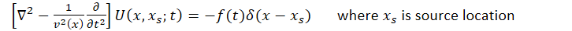

Scattering problems are easier to solve in frequency space (frequency dependent)
Apply FT to wave equation --\> scalar Helmholtz equation
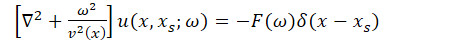

**Perturbation theory**

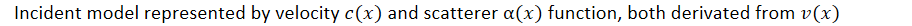
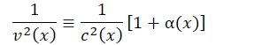
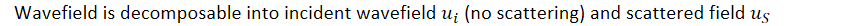
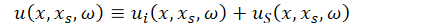

Substituted to the Helmholtz equation
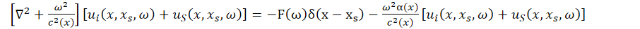

Incident Field
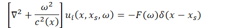
Incident field is equal to green function of background Helmholtz equation scaled by FT
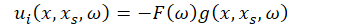

Scattered field
Expressed with same Helmholtz operator, but source function composed of interaction between incident and scattered fields
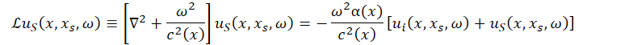

Scattered field is generated by incident wave and heterogeneity, we can directly substitute incident field green function to scattered field formulation
As scattering formulation is differential --\> defined everywhere in space
The effect of heterogeneity is distributed throughout the medium, not localized at the receiver.
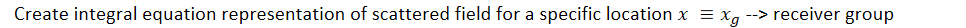
This is needed to evaluate the heterogeneity, as scattered field in g is what we observe (where we have the data)

This is the second Helmholtz equation in terms of receiver group position
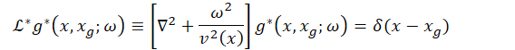
Using adjoint green function

Apply green theorem
Create integral expression evaluated at a point, based on these 2 Helmholtz equations:
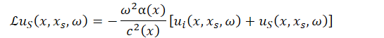
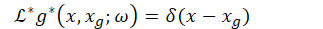

Green theorem stated as
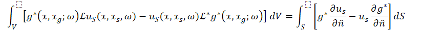

Assume S is at infinity --\> scattered energy radiates away, no incoming energy --\> surface integral term vanishes
Substitute the equation

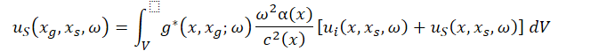

This equation is called Lippmann–Schwinger equation, because Us (product) is also in the right hand side of the equation
--\> implies infinite series solution
Us1 = gUi
Us2 = g(Ui+Us1)
Us3 = g(Ui+Us2) … etc

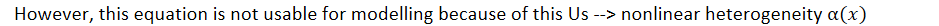
**Born Approximation**
--\> assume that scattered field is weak compared to incident field
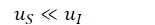
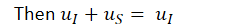
Born approximated integral equation
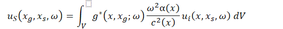
Substitute Ui

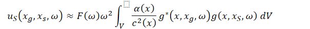
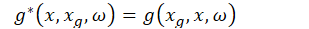
*Then*

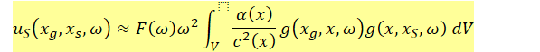

Born-approximation equation formula is only useful **when green function can be supplied**
