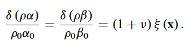
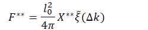
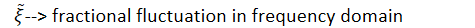
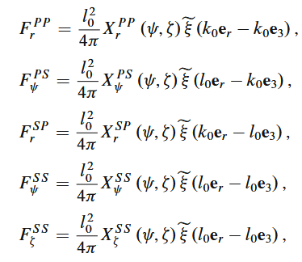
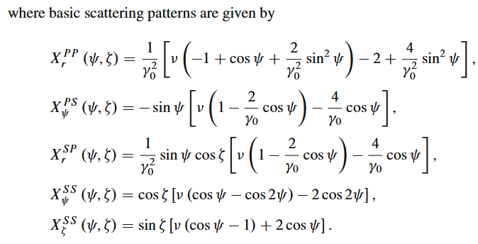
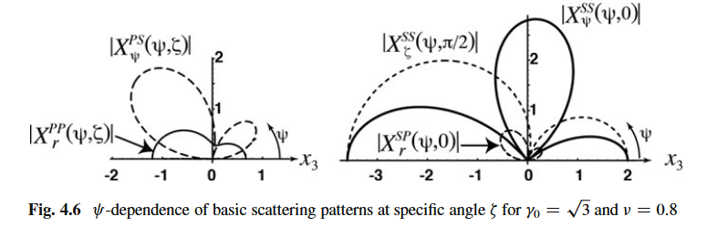

Birch Law
07 February 2026
8:46

P and S wave velocity fluctuations in real earth medium is proportional to each other
--\> reduces 2 parameters to 1
Birch law --\> relation between wave velocity and mass density
Usually scaled with v = 0.8
Thus, three independent fractional fluctuations --\> one

However v has large variations, v=8 is only used in theoretical simulations

Non zero scattering amplitudes for each modes can be rewritten as

X --\> basic scattering pattern

