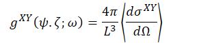
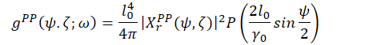
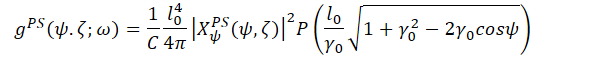
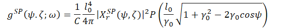
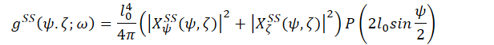
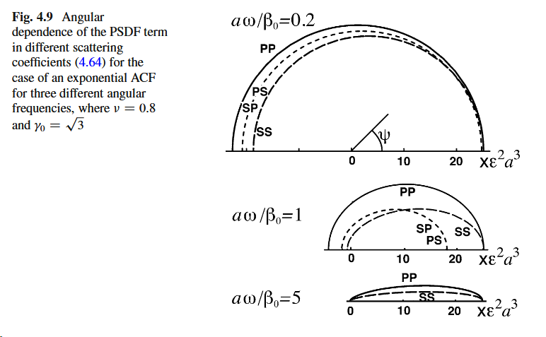
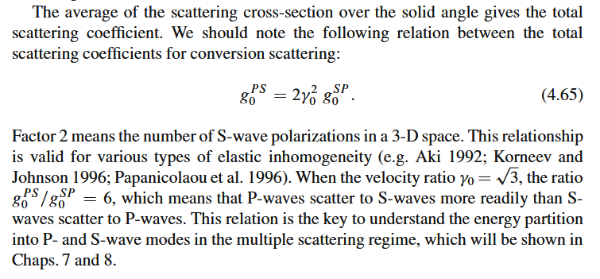
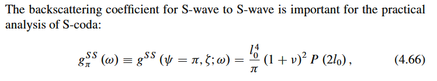
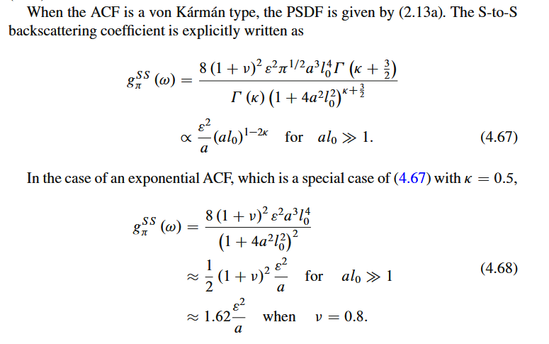
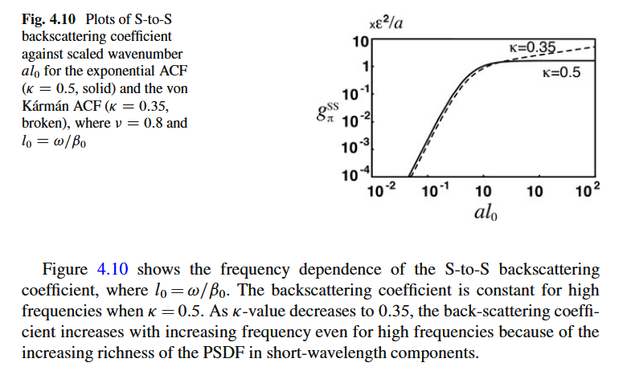

Random elastic inhomogeneity
07 February 2026
8:19

Using same procedure as scalar waves
Assumed a random elastic medium with small fractional fluctuations
Define scattering statistically --\> ensemble averages

Elastic scattering coefficients

X and Y wave type (P or S) --\> mode type
Four scattering modes formulation

PSDF distribution is symmetric around the propagation direction
All PSDF nearly isotropic for low angular frequency (top image)
At transition regime, PP and SS peak toward small scattering angle, PS and SP weaker
At high frequency, PS and SP are extremely small

**SS backscattering coefficient**

