**Scattering Coefficient**
localized inhomogeneity defined only 1 scatterer --\> in medium contains many small heterogeneity and isotropic
Velocity fluctuates randomly (ensemble random functions) with zero mean
--\> characterized by ACF or PSDF (statistics)
Divide inhomogeneous medium into block L, with L \>\> a

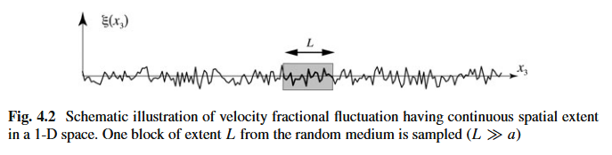

Born Approximation condition
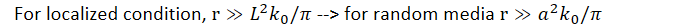
As minimum dimensions of the scattering volume are of the order of a

Ensemble averaged scattering cross section
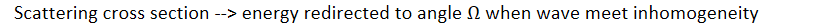
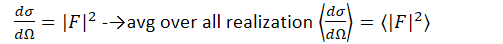
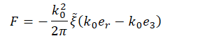
We get
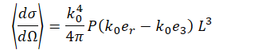

Scattering coefficient (g) is then defined as
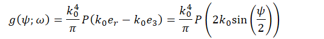
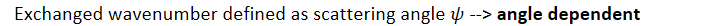
Scattering coeff is directly related to PSDF of velocity fluctuation
When random media is statistically homogenous and isotropic --\> g is axially symmetric
Scattering pattern is not necessarily isotropic even if random media is

Ratio of scattered wavefield to incident wavefield defined as
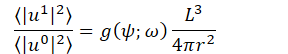

Total scattering coefficient defined as
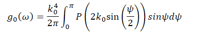
Total --\> angular average

Transport (momentum transfer) scattering defined by
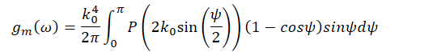
Which is the effective isotropic scattering in the multiple scattering regime --\> diffusion solution

Exponential ACF
We can substitute exponential ACF PSDF to the equation (P) to obtain
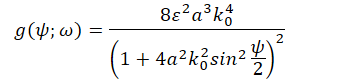
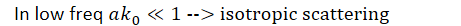
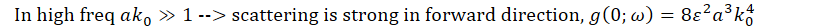
Born approximation may fail near forward direction

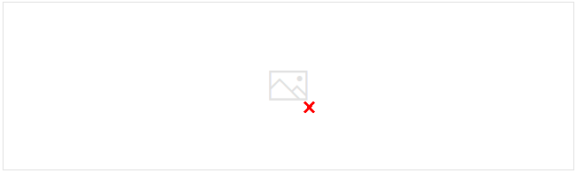

Backscattering coefficient is defined as
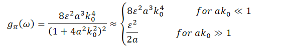
For small wavenumber --\> increases with the wavenumber
At large wavenumber --\> become uncorrelated with it

Total scattering is obtained by taking solid angle average
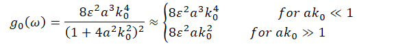
Both increased with wavenumber, although large wavenumber has lower scaling

Transport scattering is defined as
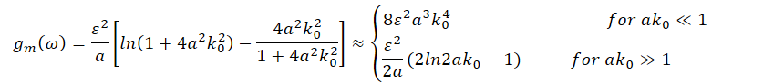
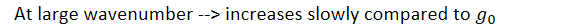

**Backscattering coefficient estimated from numerical simulation**
Jannaud et al 1991
Born theory assumes single scattering --\> coda waves is multiple scattering
Needs simulation to prove the validity of Born approximation

Based on
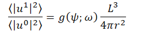

Use gaussian ACF
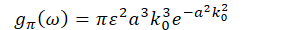
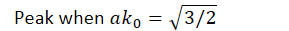

Simulation steps  
compute coda and direct wave power spectrum
Invert to estimate backscattering coefficient
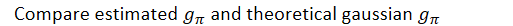

