**Diffusion Model**
Single scattering energy --\> spatial integral
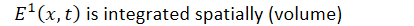
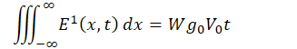
Problem --\> E is increasing with lapse time --\> do not satisfy the conservation of total energy
--\> account energy lost from the direct wave & multiple scattering

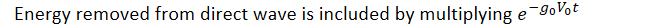
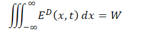

Diffusion equation
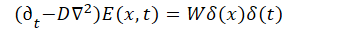

Diffusivity (D)
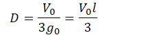

Diffusion solution
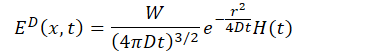
At source (r=0)
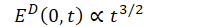
Diffusion decays more slowly e(-3/2) compared to single scattering model e(-2)

Normalized diffusion solution --\> using scaling
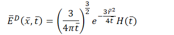
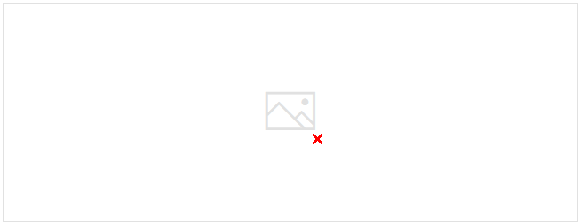
Unlike scattering, diffusion naturally produces a peak in time
Single scattering --\> monotonic decay
Diffusion --\> growth, peak, decay
Energy density spreads in front of the wavefront --\> violating causality
--\> acceptable because it is intended for late coda

Introducing Intrinsic attenuation
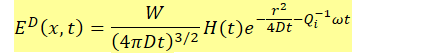
