**Single isotropic scattering model**
-→ if receiver is not at the source, how does single-scattered energy defined in space and time?
Path length is not 2ra but ra + rb
Scattered wave arrives at the receiver at time t if
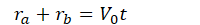

Three dimensional case
Assumed scattering is isotropic, the energy-flux density at the receiver is
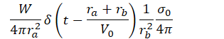
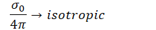
Isotropic because scatterers radiates energy equally in all direction

Energy density is calculated by summing over all scatterers and converting to an integral
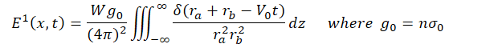
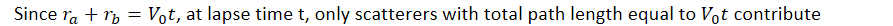
-→ satisfied with prolate speroid with
- Foci at the source and receiver
- Axis growing with time

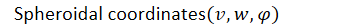

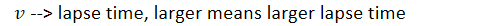
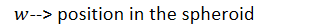
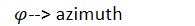
r is the distance between source and receiver
Source is at v = 1 w = -1
Receiver is at v = 1 w = 1
Scatterer at position z, is defined by z1, z2, z3
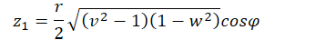
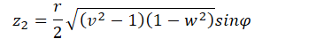
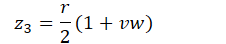
Note that
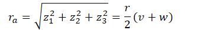
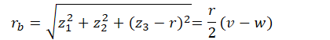
Infinitesimal volume element dz
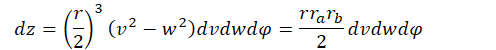
Total path
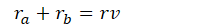
Delta function defines a spheroidal shell --\> isochronal scattering shell
--\> all scatterers contributing at the same time lapse
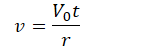
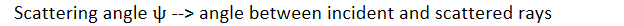
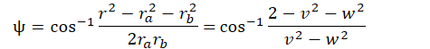
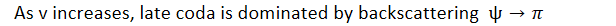
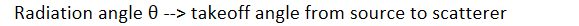
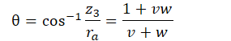

Energy density integral at lapse time t formulated as integral over the prolate spheroidal surface
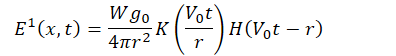
1st term --\> source strength (W) x total scattering (g0) normalized by SR distance
2nd term --\> Geometrical weighting
3rd term --\> no scattered energy before arrival (causality)
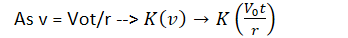
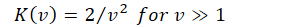
K(v) diverge as v --\> 1+, decays according to inverse square of v
v = Vot/r , if v = 1 then t=r/vo (direct arrival)

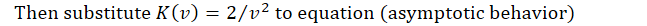
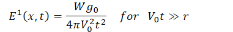
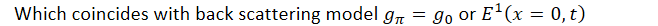
At late times, isotropic scattering behaves as if it were pure backscattering

Coda energy evolution has a universal shape once expressed in scattering units.
Physical quantities can be scaled by using total scattering coefficients, propagation velocity, and radiated energy
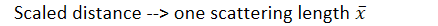
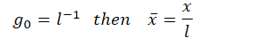
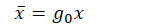
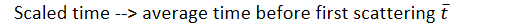
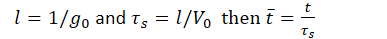
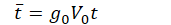
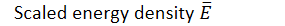
Energy density unit -→ energy/volume
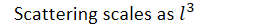
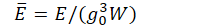

Normalized single scattering solution
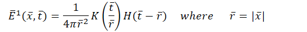
Asymptotic behavior written as
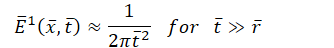
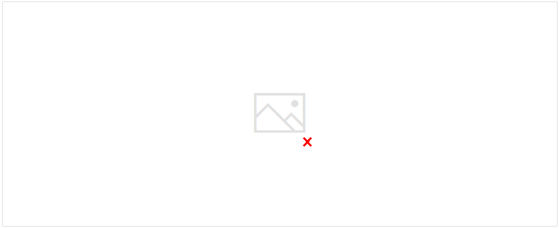

Phenomenological attenuation factor is introduced to single scattering equation
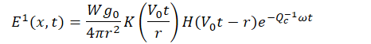

At late lapse time V0t \>\> r
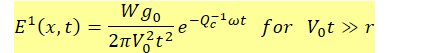
