**Single scattering models**
Single backscattering model for a common source and receiver location (Aki and Chouet 1975)
--\> explain why coda amplitude decays in time even without intrinsic attenuation

Incident energy-flux density
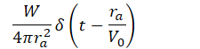
W --\> total radiated energy
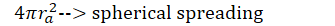
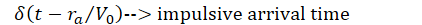
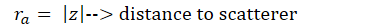

The single backscattered energy at the source
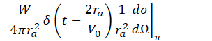
Delta function --\> two-way travel time (2ra)
Subscript π means exact backscattering (scattering angle = π =180°)

Scattered wave power --\> sum of power from individual scattered waves
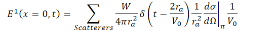
Divided by V0 because energy density = energy flux/velocity
1 -→ single scattering, multiplying with scatterer density (n), the summation replaced with an integral of scatterer location z over the whole space

The energy density become
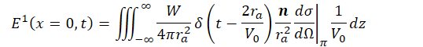

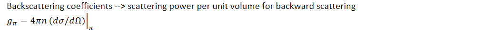
Integrated with the equation, then become
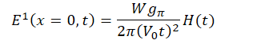
H(t) is the step function

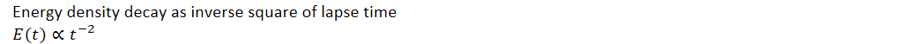
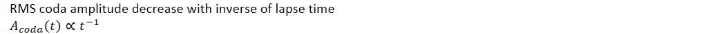
At lapse time t, only scatterers on a sphere of radius
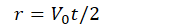

Add phenomenological attenuation --\> multiplication with an exponential damping factor at ω
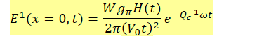
Qc is coda-attenuation factor
