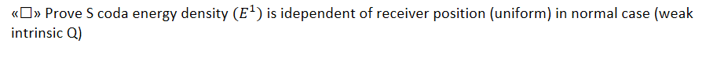

- [ ]  Create peak delay and S wave envelope (over many frequencies) from Cianjur aftershocks, measure direct EQ. and crossing EQ from predicted fault  

- [ ]  Compare Coda Normalization site amplification with HVSR  

