Heterogeneity --\> velocity/density vary irregularly
Rocks can have different descriptions but still have the same heterogeneity statistics --\> same seismic behavior
Earth heterogeneity is highly irregular, not repeatable
Instead of describing exact structure --\> describe statistics
describe how strong are the fluctuations statistically? --\> **ACF and PSDF**
ACF --\> how similar is the medium at 2 points separated by distance r?
PSDF --\> FFT of ACF --\> how much heterogeneity in wavenumber domain?
Earth is one realization of a random medium --\> from ensemble of random media with same ACF and PSDF
Any random media with same ACF/PSDF are statistically equivalent for wave propagation
If we generate many random velocity models with same ACF/PSDF --\> each simulation give similar waveform
Then it is practical to compare statistics (mean amp, intensity, etc) rather than 1 waveform, because observed seismic quantities are themselves statistical (coda waves. Scattering)
Real seismic observation sample one earth but average over many scatterers, wavelength, path --\> ensemble like

The Vp in heterogeneous medium is not constant, but a sum of mean velocity (Vo) and perturbed velocity (dV) as a function of location
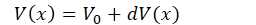
Which can be measured by fractional fluctuations of V --\> ξ(x)
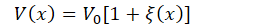

**For stationary process**
**Autocorrelation Function (ACF) R(x)**
Gives statistical measure of the spatial scale and the magnitude of **medium inhomogeneity**
--\> how similar the medium is at 2 separated points by distance x
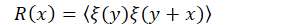
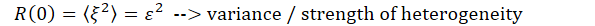
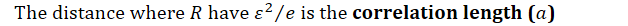
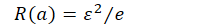

**Power Spectral Density Function (PSDF) P(m)**
Describes how much of variance (power) for each wavenumber
Fourier transform of ACM --\> PSDF
By integrating angle in spherical coordinates, the IFT formulation become
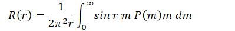
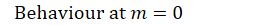
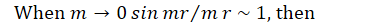
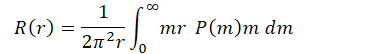
Low wavenumber behaviour of PSDF must ensure this integral is finite
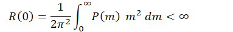
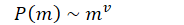
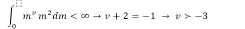

**Stationary increment case**
When random function is not strictly stationary (homogenous) over all space, but **locally stationary**
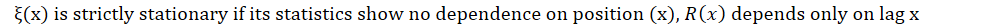
Stationary increment --\> field ξ(x) is not stationary, but increments are stationary
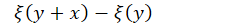
Use structure function instead of ACF
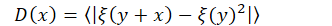
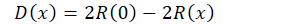
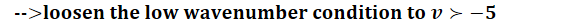
For stationary increment, the field do not need to have finite variance, only increments do
--\> allow more low-wavenumber power (more low freq energy)

**Realization of random media**
For a given PSDF P(m), it is necessary to make realizations of random media ξ(x)
- 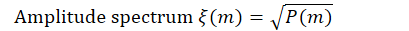
- Phase spectrum φ(m) is random between 0 and 2π
Random medium is synthesized by IFFT
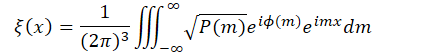
Where
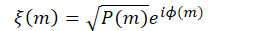
Changing random seed changes the φ(m) --\> totally new random medium field, but P(m) stays the same
- Every realization has the same PSDF
- Spatial pattern changes
- Averaging many realizations --\> theoretical covariance (ACF)
In random medium, the statistics matter and exact shapes of heterogeneity are irrelevant

**Types of ACF and PSDF random media**
**Gaussian model**
ACF formulation
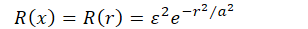
For 2D PSDF
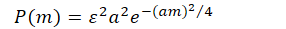
3D PSDF
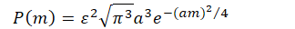

**Von Karman Model**
For 2D model
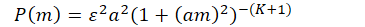
The smoothness is depend on K parameter
K\[0,1\] --\> 1 is the smoothest
---
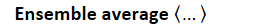
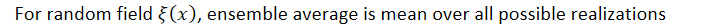
--\> same with expected value in probability theory
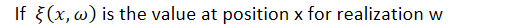
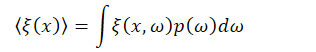
Example
For N random media with different random seeds (i.e random phase)
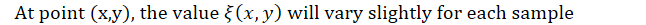
If all samples averaged --\> ensemble average
Each realization is a different map of heterogeneity
--\> stacking all maps and averaged all pixel --\> ensemble average

Ensemble average vs spatial average
Ensemble --\> average over many realizations
Spatial --\> average over space in a single realization
For stationary random field --\> ensemble ≈ spatial
--\> that’s why one random medium can be used for numerical simulations

---
**Correlation length (a)**
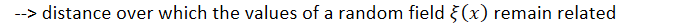
- If 2 points are separated by a distance \<a --\> have similar values
- Separated by more than a --\> uncorrelated

---
**Inhomogeneity from log data**
Test from DH-11 downhole Vs log data

**ACF** --\> autocorrelate data

Have similar pattern with von-karman model

**PSDF** --\> FFT

